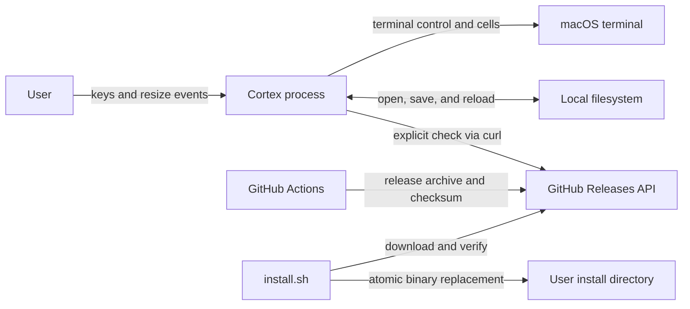
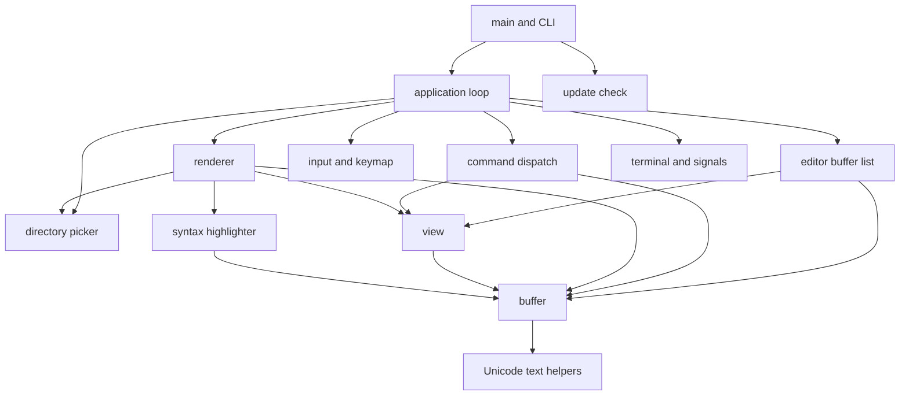
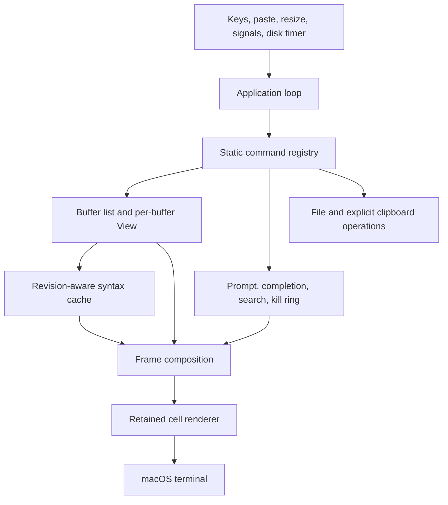

# Cortex architecture

> **Status:** Current implementation and proposed end state
>
> **Verification basis:** Working tree based on commit `9a24759`
>
> **Target basis:** `docs/prd.md`, `docs/roadmap.md`, and the boundaries already present in the code

## 1. Executive summary

Cortex is a macOS-only terminal code editor built as one Rust binary.
It runs in the terminal alternate screen, keeps file text in rope-backed in-memory buffers, translates terminal keys into editor commands, and paints a retained terminal cell grid.
The filesystem is the durable source of file contents, while GitHub Releases are the durable source of distributed binaries.

The current editor has one active screen surface and supports multiple buffers by storing one `View` beside each `Buffer`.
The main application loop owns prompts, mark and cut state, search state, directory picker transitions, and command outcomes.
Rendering, syntax highlighting, safe file persistence, terminal cleanup, and update checks are separate modules around that loop.

Opinion [high]: the end state should remain one binary crate and one owner of mutable UI state.
This changes if Cortex adds another executable, a public library API, or remote collaboration.
The main rule is that buffers store text and file state, views store point and viewport state, and rendering only reads those models to produce terminal cells.

## 2. System context

### 2.1 Current context

Cortex has no daemon, database, account, server, plugin host, or language server.
The editor process runs with the permissions of the local user.
Network access occurs only for an explicit `--check-update` command or for installation and release workflows outside the editor process.

### 2.2 Current runtime dependency direction

Dependencies point inward toward editor data and outward toward terminal, filesystem, process, and network adapters.
There is no formal crate-level enforcement because all modules are in one binary crate.

## 3. Current architectural invariants

1. A `Buffer` owns text, file path, disk baseline, dirty state, undo and redo history, change markers, and text revision.
2. A `View` owns point, vertical scroll, horizontal scroll, the last rendered viewport height, and the preferred terminal column for vertical movement.
3. Point and edit boundaries are Rope character indexes that are clamped to extended grapheme cluster boundaries.
4. `Editor` deduplicates open buffers by normalized macOS path identity and keeps one active buffer.
5. The active buffer has exactly one stored `View` in the current implementation.
6. Only the application loop mutates editor and application state.
7. Key input passes through `Keymap`, but prompt, search, mark, cut, yank, file-open, and buffer-switch behavior is still handled directly by `AppState`.
8. A dirty buffer is never reloaded without refusal, and quitting with any dirty buffer requires explicit confirmation.
9. Saving never truncates an existing file in place.
10. Ordinary file saves use a sibling temporary file, sync it, preserve macOS metadata, validate the disk baseline, and commit with a macOS atomic rename operation.
11. File content and file names are converted into styled cells before terminal output, and control graphemes are shown as spaces rather than emitted as terminal control sequences.
12. `Renderer` owns syntax cache state and the last successfully flushed cell frame.
13. A failed render does not replace the retained frame.
14. `TerminalSession` owns raw mode, alternate-screen state, cursor visibility, and reverse-order cleanup.
15. Registered `SIGHUP` and `SIGTERM` signals leave the event loop so normal cleanup can run.

## 4. Current components and dependencies

| Component | Owns | Depends on | Does not own |
| --- | --- | --- | --- |
| `main.rs` and `cli.rs` | Argument parsing, exit status, and top-level mode selection | Application runner and update checker | Editor state or terminal cleanup |
| `app.rs` | Main event loop, transient UI state, nested picker flow, and coordination | Editor, commands, input, picker, renderer, terminal, and signals | Buffer text or retained terminal cells |
| `editor.rs` | Buffer collection, active index, per-buffer view, and path deduplication | Buffer, View, filesystem path metadata, and macOS path rules | Editing operations or screen layout |
| `buffer.rs` | Rope text, file identity and baseline, history, revisions, changed lines, save and reload rules | Ropey, Unicode helpers, filesystem, randomness, and macOS file APIs | Point, scrolling, prompt state, or screen cells |
| `view.rs` | Point, scroll offsets, viewport height, and preferred display column | Buffer queries | Text, file identity, or rendering styles |
| `commands.rs` | Core editing, movement, save, reload, undo, redo, and quit outcomes | Buffer and View | Prompt-driven commands and application-wide state |
| `command_registry.rs` | Static names, aliases, descriptions, argument validation, and prefix completion | Command enum | Editor state or command execution |
| `input.rs` and `keymap.rs` | Terminal-key normalization and one pending `C-x` prefix | Crossterm events and the command enum | Command execution or configurable bindings |
| `picker.rs` | Directory tree rows, selection, lazy expansion, and picker key handling | Filesystem directory reads and normalized input keys | File buffers or the editor event loop |
| `highlighter.rs` | Language definitions and buffer-revision keyed highlight caches | Buffer text windows and Tree-sitter | Buffer text or terminal styles |
| `renderer.rs` | Theme, frame composition, syntax highlighter, retained cells, diffing, and flush | Buffer, View, picker, Unicode helpers, and Crossterm | Editor mutations or terminal lifecycle |
| `terminal.rs` and `signals.rs` | Raw-mode lifecycle, alternate screen, cursor cleanup, signal flags, and PTY-controller disconnect detection | Crossterm, signal-hook, libc, and one monitor thread | Editor state or rendering policy |
| `text.rs` | Grapheme segmentation, display width, Rope boundary, clipping, and column helpers | Unicode crates and Ropey | Buffer history or terminal styling |
| `update.rs` | Explicit release lookup and semantic version comparison | A fixed GitHub API URL and the system `curl` command | Installation or automatic updates |
| GitHub workflows and scripts | CI, security audit, packaging, release publication, nightlies, and install verification | GitHub Actions, Rust tooling, macOS tools, and GitHub Releases | Runtime editor behavior |

## 5. Current critical flows

### 5.1 Startup and shutdown

1. `main` parses zero or one path, or handles help, version, and update-check flags without entering the editor.
2. `app::run` registers `SIGHUP` and `SIGTERM` flags before it opens a file or terminal session.
3. A directory path starts the directory picker, while a file or missing path opens a `Buffer`.
4. `TerminalSession::enter` starts disconnect monitoring, enables raw mode, enters the alternate screen, and hides the cursor.
5. Any partial setup failure runs the cleanup steps already made necessary.
6. Normal quit, handled termination signals, input errors, and render errors unwind through `TerminalSession::drop`.
7. Cleanup shows the cursor, leaves the alternate screen, and disables raw mode in that order.
8. A PTY controller disconnect can call `_exit(1)` from the monitor thread because no controller remains to receive cleanup output.

### 5.2 Input, command, and render

1. The main thread polls Crossterm for up to 50 milliseconds so it can also observe termination flags.
2. A pressed key becomes the internal `Key` enum.
3. Dirty-quit and prompt input take priority over the keymap.
4. Otherwise, `Keymap` resolves the key or a pending `C-x` prefix to a `Command`.
5. `AppState` handles application-wide actions, while `commands::dispatch` handles the core buffer and view actions.
6. The command mutates the active `Buffer`, its `View`, or transient `AppState` and returns an `AppAction` or `CommandOutcome`.
7. The application may open a file, switch the active buffer, enter a nested directory picker, or stop the loop.
8. After each handled key and resize event, the active view is adjusted to keep point visible and the editor is rendered.
9. `Renderer` asks `SyntaxHighlighter` for visible-line spans, composes a complete cell frame, compares it with the last frame, writes changed cell runs, restores style and cursor state, flushes, and then retains the new frame.

### 5.3 Open, save, disk change, and reload

1. Opening resolves the path as a missing file, regular file, or symlink to a regular file.
2. A file read is accepted only when its metadata is stable before and after the read and its visible path still resolves to the same location.
3. `Editor` computes a normalized identity so aliases of the same path switch to the existing buffer instead of opening a duplicate.
4. Editing updates the Rope, records an edit in an undo group, advances the revision and history state, clears redo, and updates changed-line ranges.
5. A save first verifies that the path, file identity, metadata stamp, and clean text baseline have not changed unexpectedly.
6. Cortex creates a private sibling temporary file with a random name, writes and syncs the new text, copies existing metadata or derives new-file metadata, and validates the source again.
7. A missing target commits with `RENAME_EXCL`, while an existing target commits with `RENAME_SWAP`.
8. Cortex verifies the committed inode, visible path, original content, and metadata, then removes the displaced old file.
9. If commit verification fails, Cortex attempts a guarded rollback and reports a recovery path when safe rollback is no longer possible.
10. A successful save updates the clean text, disk baseline, save location, dirty state, and changed-line baseline.
11. Before a render, the active buffer checks for disk changes when at least one second has elapsed since the previous check.
12. Manual reload refuses a dirty buffer, reads a stable replacement, resets history and caches, and restores point by line and terminal column with clamping.

### 5.4 Directory browsing

1. Directory startup or find-file on a directory enters a nested picker loop inside the same terminal session.
2. The picker reads non-hidden entries, sorts directories before files, and loads child directories only when expanded.
3. Regular files and symlinks to regular files can be opened.
4. Other filesystem objects remain visible but cannot be opened.
5. Returning to the editor invalidates the retained frame so the whole editor surface is repainted safely.

### 5.5 Update, build, and release

1. `cortex --check-update` invokes `curl` with fixed timeouts against the latest GitHub Release endpoint.
2. It compares the local package version with the returned tag and never changes the installed binary.
3. Pull requests and `main` pushes run formatting, Clippy, tests, and a release build on macOS.
4. Release tags are verified as descendants of `main`, checked, built for `aarch64-apple-darwin`, packaged reproducibly, checksummed, attested, and published.
5. The installer verifies the checksum, extracts one executable, stages it in the destination directory, and atomically replaces the installed binary.

## 6. Current interfaces and data ownership

### 6.1 Runtime interfaces

The user-facing process interface is `cortex [path]`, `cortex --version`, and `cortex --check-update`.
The editor accepts Crossterm key, paste, and resize events and emits terminal control operations and styled text.
Paste events insert one literal text edit or append sanitized single-line text to the active prompt.
Named commands and slash aliases are parsed through the static table in `command_registry.rs`.
The same table supplies minibuffer prefix hints, Tab completion, and command help.

The keymap and named commands pass typed `Command` values through `AppState::execute_command`.
Application actions run there; buffer and view actions delegate to `commands::dispatch`.
Named path and search arguments are separate from keymap state.

### 6.2 Identity and stored data

`Buffer.id` is a process-local monotonic integer used to key syntax caches.
It is not persisted and has no meaning after exit.
Open-buffer identity is a normalized absolute path that accounts for canonical existing ancestors, missing suffixes, volume case sensitivity, Unicode decomposition, and case folding.

The buffer path remains the user-visible file name and save location.
`SaveLocation` records whether that path was missing, a regular file, or a symlink to a stable regular-file target when last observed.
`DiskStamp` records device, inode, length, modification time, and change time.
The filesystem owns durable file content and metadata.

All editor, view, history, prompt, mark, cut, search, picker, highlight, and retained-frame state is process memory only.
No session state is restored after exit.

### 6.3 Compatibility

The source and distributed binary target macOS.
Stable packages currently target Apple silicon with the `aarch64-apple-darwin` triple.
Text files are read and written as UTF-8 through Ropey.
Unsupported syntax languages remain plain text.
Long lines are clipped and horizontally scrolled rather than wrapped.

## 7. Security and trust boundaries

Cortex has no authentication or authorization layer.
The operating system user identity and filesystem permissions are the authority boundary.
Paths, file contents, directory names, terminal input, GitHub responses, release archives, and dependency updates are untrusted inputs.

File and directory text is cellized before output.
Control graphemes are replaced with a visible space, which prevents ordinary file contents from injecting terminal escape sequences.
Save operations reject non-regular targets, broken or retargeted symlinks, unexpected disk changes, and ambiguous commit cleanup rather than silently overwriting them.
Temporary save files are created exclusively with private permissions and suppressed inherited ACLs before buffer data is written.

The explicit update check executes the system `curl` binary with fixed arguments and does not interpolate user input into a shell command.
The installer downloads over HTTPS, verifies the published SHA-256 checksum, and atomically replaces only the selected install path.
Release workflows use pinned action revisions and limited GitHub token permissions.

## 8. Failure, capacity, and operations

Cortex is a local foreground process with no service deployment or runtime telemetry.
Errors are returned to `main` or shown in the modeline.
There is no retry loop for ordinary editor commands.
Stable file reads retry up to three times, and temporary-file creation tries up to 128 random names.

The main UI path is synchronous.
The only persistent runtime background work is the terminal-disconnect monitor thread.
Explicit clipboard commands spawn pbcopy or pbpaste with piped input/output and an enforced UTF-8 locale.
Nonblocking pipe I/O and child exit polling share a two-second deadline; failures kill and reap the child.
Transfers are limited to 16 MiB, and copy checks the selected Rope byte length before materializing text.
Clipboard paste uses the same application text path as terminal paste, including single-line prompt conversion.
Tree-sitter work is bounded by visible ranges, read-ahead windows, per-line character limits, and a small checkpoint cache for Rust and Markdown.
The retained renderer rejects terminal sizes above 1,000,000 cells, which turns an uncontrolled allocation into a recoverable render error followed by terminal cleanup.

Rope text, clean baselines, open buffers, and some syntax caches grow with user work.
Undo and redo retain at most 16 MiB of inserted and deleted UTF-8 text per buffer, except that the newest group is always retained.
The buffer evicts oldest whole groups with a deque and keeps history identities independent of retention.
Each edit keeps its structural line-change metadata; grouped undo reverses these edits in order.
Typing and same-direction deletion use explicit timestamps with a 750 ms pause boundary.
The application, command dispatch, and buffer-switch paths end groups for deliberate actions.
Word boundaries traverse Rope graphemes using Unicode alphanumeric and underscore classes, without copying the buffer.
Word movement and word kills share these boundaries; paging uses the View viewport height with a two-line overlap.
Open-buffer count, clean baselines, and history metadata have no separate memory budget.
The kill ring retains at most 32 complete nonempty cuts; its text has no separate byte limit.
Application yank state records buffer identity, revision, the exact inserted range, point, and ring index.
Yank-pop validates that state before replacing text, and other completed commands invalidate it.
Forward search currently materializes the complete Rope as one `String` for each search.

Disk-change checks only occur immediately before a render and only inspect the active buffer.
An idle editor does not repaint merely because the one-second interval elapsed.
There is no file watcher, automatic reload, PTY pane, or asynchronous job queue.

## 9. Verification

The main proof is the Rust test suite colocated with each module.
Pure tests cover buffer edits, history, grapheme behavior, path identity, safe saves, reloads, commands, key resolution, picker state, highlighting, frame composition, diff painting, update parsing, and terminal cleanup state.
Ignored local performance checks cover large Rope edits, deep viewport rendering, deep syntax highlighting, and large-buffer search.

`tests/signal_cleanup.rs` provides process-level PTY checks for alternate-screen cleanup, cursor restoration, raw-mode restoration, termination signals, controller disconnects, nested picker exit, and oversized render failures.
GitHub CI runs `cargo fmt --check`, `cargo clippy -- -D warnings`, `cargo test`, and `cargo build --release` on macOS.
The security workflow runs `cargo audit` separately because its advisory database changes independently of the code.

No automated test proves the subjective latency, visual balance, or cursor feel of a real terminal session.
Those properties still require the manual smoke checks described in `CONTRIBUTING.md` and `docs/performance.md`.

## 10. Known limitations of the current architecture

- `app.rs` remains both the event-loop coordinator and owner of several editor behaviors.
- The directory picker runs a nested event loop and has its own renderer instance rather than being another state in one application loop.
- Mark and the kill ring live in application state; mark has not moved into View.
- Command completion uses name prefixes; incremental search and fuzzy buffer or file selection are not implemented.
- External disk changes are polled only for the active buffer when another event causes a render.
- Syntax parsing and all filesystem operations run synchronously on the main thread.
- History text has a retention budget; per-edit metadata, open-buffer count, and clean Rope baselines have no separate memory budget.
- The update response parser extracts one JSON field without a JSON parser, although its failure is isolated to the explicit update-check command.

## 11. Target architecture for daily editing

The target follows the one-view product direction in [docs/prd.md](docs/prd.md) and delivery issue [#160](https://github.com/owainlewis/cortex/issues/160).
This section is proposed behavior until the corresponding task is merged.
Internal splits, tabs, terminal emulation, and a configuration subsystem are outside this batch.
External terminal panes own shells, coding agents, and process sessions.

Opinion [high]: preserve the current single binary and separate responsibilities only where new behavior needs a clear owner.
This changes if the product needs shared unsaved views or an external editor API.
The existing buffer/view pairing is adequate for one visible buffer and does not need a speculative window store.

### Ownership and interaction

The application loop orders user input, disk checks, command outcomes, and redraws.
Only that loop mutates editor state.
Dedicated prompt/search state owns text, selection, match ranges, cancellation origins, and completion lifecycle.
The command registry owns names and discovery metadata while command handlers perform the same operations reached through keybindings.
The editor retains unique file buffers, an active buffer, and each buffer's view state.
Closing a dirty buffer requires confirmation and never discards another buffer's text.

Buffer history now has explicit edit boundaries and grouped typing without losing save-baseline or changed-line metadata.
The retained undo/redo text payload has a 16 MiB per-buffer budget with whole-group eviction; the newest group is retained even when it exceeds that budget.
Paste, indentation, kills, yanks, and replacement remain deliberate edits.
Clipboard access is isolated behind a small macOS adapter and occurs only on explicit commands.
Project-file discovery respects ignores and does not follow directory symlinks; its work and candidate set are bounded and cancellable.

Syntax state remains outside the text buffer and is keyed by stable buffer identity and revision.
Incremental or scheduled parsing must preserve multiline context and reject obsolete results.
A measured algorithm is chosen in #163; using plain text to conceal slow ordinary supported-language parsing does not satisfy that task.
Frame composition reads text, syntax, selection, search, completion, and status state to produce one terminal cell grid.
Diff painting remains independent of file and command semantics.

### Failure and lifecycle

Invalid commands and prompt cancellation leave buffer text intact.
Clipboard failures show an error without modifying text.
Directory errors preserve the current editor and allow a new path or cancellation.
Disk polling checks metadata while idle and indicates external changes; it never reloads unsaved text automatically.
A stale completion or syntax result cannot change a different buffer or revision.
Terminal paste mode joins raw mode, alternate screen, and cursor state in reverse-order cleanup, including partial startup.

The current atomic-save, Unicode, path-identity, retained-frame, and dirty-buffer invariants remain unchanged.
No terminal child processes, layout tree, or background agent protocol are introduced.
Any parsing or discovery worker must have bounded queues, cancellation, and shutdown handling defined in its task plan.

## 12. Delivery and acceptance

The ordered implementation tasks and acceptance criteria are maintained in [#160](https://github.com/owainlewis/cortex/issues/160) and [docs/roadmap.md](docs/roadmap.md).
Keep current-implementation sections above accurate as each task lands.
Final proof covers typing, literal paste, grouped undo, clipboard, kill ring, file and buffer navigation, incremental search, replacement, syntax, save/reload, and quit in one release-mode session.
Repeat the session inside an isolated tmux instance and verify resize, truecolor, and shell restoration.
The required formatting, Clippy, complete test, release-build, and performance checks must have recorded results.

## 13. Source map

The current entry point and orchestration are defined in [`src/main.rs`](src/main.rs), [`src/cli.rs`](src/cli.rs), and [`src/app.rs`](src/app.rs).
Buffer ownership, file safety, history, disk baselines, and text revisions are defined in [`src/buffer.rs`](src/buffer.rs).
The current multi-buffer owner and path identity rules are defined in [`src/editor.rs`](src/editor.rs).
Point and viewport ownership are defined in [`src/view.rs`](src/view.rs).
Commands and key resolution are defined in [`src/commands.rs`](src/commands.rs), [`src/input.rs`](src/input.rs), and [`src/keymap.rs`](src/keymap.rs).
Frame composition and diff painting are defined in [`src/renderer.rs`](src/renderer.rs).
Syntax cache ownership and visible-range parsing are defined in [`src/highlighter.rs`](src/highlighter.rs).
Terminal lifecycle and signal behavior are defined in [`src/terminal.rs`](src/terminal.rs), [`src/signals.rs`](src/signals.rs), and [`tests/signal_cleanup.rs`](tests/signal_cleanup.rs).
Directory browsing is defined in [`src/picker.rs`](src/picker.rs).
Unicode editing and display rules are defined in [`src/text.rs`](src/text.rs).
Product intent and delivery order are defined in [`docs/prd.md`](docs/prd.md) and [`docs/roadmap.md`](docs/roadmap.md).
Performance proof and local checks are defined in [`docs/performance.md`](docs/performance.md) and [`src/performance.rs`](src/performance.rs).
Build, release, security, and install behavior is defined under [`.github/workflows`](.github/workflows), [`.github/scripts`](.github/scripts), and [`install.sh`](install.sh).
