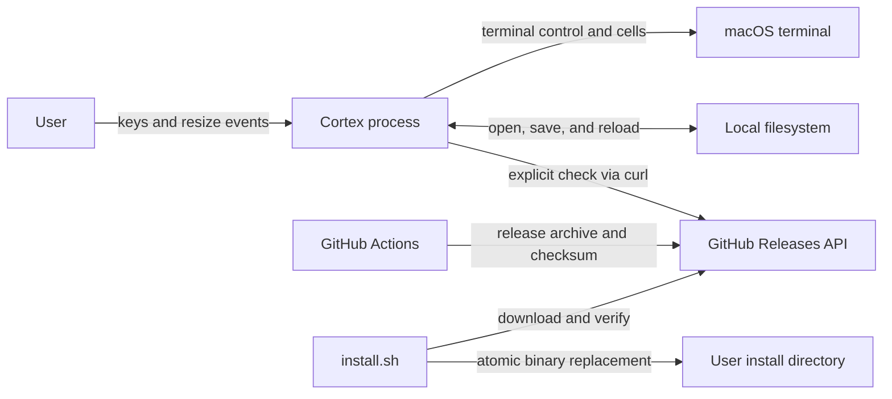
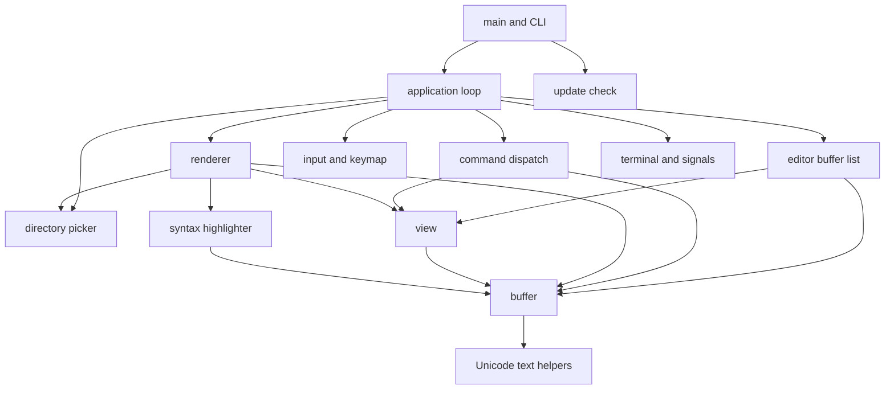
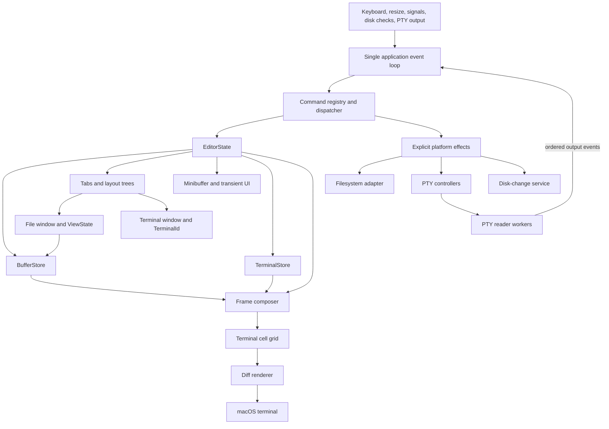

# Cortex architecture

> **Status:** Current implementation and proposed end state
>
> **Verification basis:** Working tree based on commit `9a24759`
>
> **Target basis:** `docs/prd.md`, `docs/roadmap.md`, and the boundaries already present in the code

## 1. Executive summary

Cortex is a macOS-only terminal code editor built as one Rust binary.
It runs in the terminal alternate screen, keeps file text in rope-backed in-memory buffers, translates terminal keys into editor commands, and paints a retained terminal cell grid.
The filesystem is the durable source of file contents, while GitHub Releases are the durable source of distributed binaries.

The current editor has one active screen surface and supports multiple buffers by storing one `View` beside each `Buffer`.
The main application loop owns prompts, mark and cut state, search state, directory picker transitions, and command outcomes.
Rendering, syntax highlighting, safe file persistence, terminal cleanup, and update checks are separate modules around that loop.

Opinion [high]: the end state should remain one binary crate and one owner of mutable UI state.
This changes if Cortex adds another executable, a public library API, or remote collaboration.
The main rule is that buffers store text and file state, windows store point and viewport state, and rendering only reads those models to produce terminal cells.

## 2. System context

### 2.1 Current context

Cortex has no daemon, database, account, server, plugin host, or language server.
The editor process runs with the permissions of the local user.
Network access occurs only for an explicit `--check-update` command or for installation and release workflows outside the editor process.

### 2.2 Current runtime dependency direction

Dependencies point inward toward editor data and outward toward terminal, filesystem, process, and network adapters.
There is no formal crate-level enforcement because all modules are in one binary crate.

## 3. Current architectural invariants

1. A `Buffer` owns text, file path, disk baseline, dirty state, undo and redo history, change markers, and text revision.
2. A `View` owns point, vertical scroll, horizontal scroll, and the preferred terminal column for vertical movement.
3. Point and edit boundaries are Rope character indexes that are clamped to extended grapheme cluster boundaries.
4. `Editor` deduplicates open buffers by normalized macOS path identity and keeps one active buffer.
5. The active buffer has exactly one stored `View` in the current implementation.
6. Only the application loop mutates editor and application state.
7. Key input passes through `Keymap`, but prompt, search, mark, cut, yank, file-open, and buffer-switch behavior is still handled directly by `AppState`.
8. A dirty buffer is never reloaded without refusal, and quitting with any dirty buffer requires explicit confirmation.
9. Saving never truncates an existing file in place.
10. Ordinary file saves use a sibling temporary file, sync it, preserve macOS metadata, validate the disk baseline, and commit with a macOS atomic rename operation.
11. File content and file names are converted into styled cells before terminal output, and control graphemes are shown as spaces rather than emitted as terminal control sequences.
12. `Renderer` owns syntax cache state and the last successfully flushed cell frame.
13. A failed render does not replace the retained frame.
14. `TerminalSession` owns raw mode, alternate-screen state, cursor visibility, and reverse-order cleanup.
15. Registered `SIGHUP` and `SIGTERM` signals leave the event loop so normal cleanup can run.

## 4. Current components and dependencies

| Component | Owns | Depends on | Does not own |
| --- | --- | --- | --- |
| `main.rs` and `cli.rs` | Argument parsing, exit status, and top-level mode selection | Application runner and update checker | Editor state or terminal cleanup |
| `app.rs` | Main event loop, transient UI state, nested picker flow, and coordination | Editor, commands, input, picker, renderer, terminal, and signals | Buffer text or retained terminal cells |
| `editor.rs` | Buffer collection, active index, per-buffer view, and path deduplication | Buffer, View, filesystem path metadata, and macOS path rules | Editing operations or screen layout |
| `buffer.rs` | Rope text, file identity and baseline, history, revisions, changed lines, save and reload rules | Ropey, Unicode helpers, filesystem, randomness, and macOS file APIs | Point, scrolling, prompt state, or screen cells |
| `view.rs` | Point, scroll offsets, and preferred display column | Buffer queries | Text, file identity, or rendering styles |
| `commands.rs` | Core editing, movement, save, reload, undo, redo, and quit outcomes | Buffer and View | Prompt-driven commands and application-wide state |
| `input.rs` and `keymap.rs` | Terminal-key normalization and one pending `C-x` prefix | Crossterm events and the command enum | Command execution or configurable bindings |
| `picker.rs` | Directory tree rows, selection, lazy expansion, and picker key handling | Filesystem directory reads and normalized input keys | File buffers or the editor event loop |
| `highlighter.rs` | Language definitions and buffer-revision keyed highlight caches | Buffer text windows and Tree-sitter | Buffer text or terminal styles |
| `renderer.rs` | Theme, frame composition, syntax highlighter, retained cells, diffing, and flush | Buffer, View, picker, Unicode helpers, and Crossterm | Editor mutations or terminal lifecycle |
| `terminal.rs` and `signals.rs` | Raw-mode lifecycle, alternate screen, cursor cleanup, signal flags, and PTY-controller disconnect detection | Crossterm, signal-hook, libc, and one monitor thread | Editor state or rendering policy |
| `text.rs` | Grapheme segmentation, display width, Rope boundary, clipping, and column helpers | Unicode crates and Ropey | Buffer history or terminal styling |
| `update.rs` | Explicit release lookup and semantic version comparison | A fixed GitHub API URL and the system `curl` command | Installation or automatic updates |
| GitHub workflows and scripts | CI, security audit, packaging, release publication, nightlies, and install verification | GitHub Actions, Rust tooling, macOS tools, and GitHub Releases | Runtime editor behavior |

## 5. Current critical flows

### 5.1 Startup and shutdown

1. `main` parses zero or one path, or handles help, version, and update-check flags without entering the editor.
2. `app::run` registers `SIGHUP` and `SIGTERM` flags before it opens a file or terminal session.
3. A directory path starts the directory picker, while a file or missing path opens a `Buffer`.
4. `TerminalSession::enter` starts disconnect monitoring, enables raw mode, enters the alternate screen, and hides the cursor.
5. Any partial setup failure runs the cleanup steps already made necessary.
6. Normal quit, handled termination signals, input errors, and render errors unwind through `TerminalSession::drop`.
7. Cleanup shows the cursor, leaves the alternate screen, and disables raw mode in that order.
8. A PTY controller disconnect can call `_exit(1)` from the monitor thread because no controller remains to receive cleanup output.

### 5.2 Input, command, and render

1. The main thread polls Crossterm for up to 50 milliseconds so it can also observe termination flags.
2. A pressed key becomes the internal `Key` enum.
3. Dirty-quit and prompt input take priority over the keymap.
4. Otherwise, `Keymap` resolves the key or a pending `C-x` prefix to a `Command`.
5. `AppState` handles application-wide actions, while `commands::dispatch` handles the core buffer and view actions.
6. The command mutates the active `Buffer`, its `View`, or transient `AppState` and returns an `AppAction` or `CommandOutcome`.
7. The application may open a file, switch the active buffer, enter a nested directory picker, or stop the loop.
8. After each handled key and resize event, the active view is adjusted to keep point visible and the editor is rendered.
9. `Renderer` asks `SyntaxHighlighter` for visible-line spans, composes a complete cell frame, compares it with the last frame, writes changed cell runs, restores style and cursor state, flushes, and then retains the new frame.

### 5.3 Open, save, disk change, and reload

1. Opening resolves the path as a missing file, regular file, or symlink to a regular file.
2. A file read is accepted only when its metadata is stable before and after the read and its visible path still resolves to the same location.
3. `Editor` computes a normalized identity so aliases of the same path switch to the existing buffer instead of opening a duplicate.
4. Editing updates the Rope, records an undo edit, advances the revision and history state, clears redo, and updates changed-line ranges.
5. A save first verifies that the path, file identity, metadata stamp, and clean text baseline have not changed unexpectedly.
6. Cortex creates a private sibling temporary file with a random name, writes and syncs the new text, copies existing metadata or derives new-file metadata, and validates the source again.
7. A missing target commits with `RENAME_EXCL`, while an existing target commits with `RENAME_SWAP`.
8. Cortex verifies the committed inode, visible path, original content, and metadata, then removes the displaced old file.
9. If commit verification fails, Cortex attempts a guarded rollback and reports a recovery path when safe rollback is no longer possible.
10. A successful save updates the clean text, disk baseline, save location, dirty state, and changed-line baseline.
11. Before a render, the active buffer checks for disk changes when at least one second has elapsed since the previous check.
12. Manual reload refuses a dirty buffer, reads a stable replacement, resets history and caches, and restores point by line and terminal column with clamping.

### 5.4 Directory browsing

1. Directory startup or find-file on a directory enters a nested picker loop inside the same terminal session.
2. The picker reads non-hidden entries, sorts directories before files, and loads child directories only when expanded.
3. Regular files and symlinks to regular files can be opened.
4. Other filesystem objects remain visible but cannot be opened.
5. Returning to the editor invalidates the retained frame so the whole editor surface is repainted safely.

### 5.5 Update, build, and release

1. `cortex --check-update` invokes `curl` with fixed timeouts against the latest GitHub Release endpoint.
2. It compares the local package version with the returned tag and never changes the installed binary.
3. Pull requests and `main` pushes run formatting, Clippy, tests, and a release build on macOS.
4. Release tags are verified as descendants of `main`, checked, built for `aarch64-apple-darwin`, packaged reproducibly, checksummed, attested, and published.
5. The installer verifies the checksum, extracts one executable, stages it in the destination directory, and atomically replaces the installed binary.

## 6. Current interfaces and data ownership

### 6.1 Runtime interfaces

The user-facing process interface is `cortex [path]`, `cortex --version`, and `cortex --check-update`.
The editor accepts Crossterm key and resize events and emits terminal control operations and styled text.
Named slash commands are parsed directly in `AppState`; they are not yet entries in a registry.

The internal command interface is the `Command` enum plus `commands::dispatch`.
It is incomplete as a system seam because several enum variants are intentionally intercepted by `AppState` and return an empty outcome from the dispatcher.

### 6.2 Identity and stored data

`Buffer.id` is a process-local monotonic integer used to key syntax caches.
It is not persisted and has no meaning after exit.
Open-buffer identity is a normalized absolute path that accounts for canonical existing ancestors, missing suffixes, volume case sensitivity, Unicode decomposition, and case folding.

The buffer path remains the user-visible file name and save location.
`SaveLocation` records whether that path was missing, a regular file, or a symlink to a stable regular-file target when last observed.
`DiskStamp` records device, inode, length, modification time, and change time.
The filesystem owns durable file content and metadata.

All editor, view, history, prompt, mark, cut, search, picker, highlight, and retained-frame state is process memory only.
No session state is restored after exit.

### 6.3 Compatibility

The source and distributed binary target macOS.
Stable packages currently target Apple silicon with the `aarch64-apple-darwin` triple.
Text files are read and written as UTF-8 through Ropey.
Unsupported syntax languages remain plain text.
Long lines are clipped and horizontally scrolled rather than wrapped.

## 7. Security and trust boundaries

Cortex has no authentication or authorization layer.
The operating system user identity and filesystem permissions are the authority boundary.
Paths, file contents, directory names, terminal input, GitHub responses, release archives, and dependency updates are untrusted inputs.

File and directory text is cellized before output.
Control graphemes are replaced with a visible space, which prevents ordinary file contents from injecting terminal escape sequences.
Save operations reject non-regular targets, broken or retargeted symlinks, unexpected disk changes, and ambiguous commit cleanup rather than silently overwriting them.
Temporary save files are created exclusively with private permissions and suppressed inherited ACLs before buffer data is written.

The explicit update check executes the system `curl` binary with fixed arguments and does not interpolate user input into a shell command.
The installer downloads over HTTPS, verifies the published SHA-256 checksum, and atomically replaces only the selected install path.
Release workflows use pinned action revisions and limited GitHub token permissions.

## 8. Failure, capacity, and operations

Cortex is a local foreground process with no service deployment or runtime telemetry.
Errors are returned to `main` or shown in the modeline.
There is no retry loop for ordinary editor commands.
Stable file reads retry up to three times, and temporary-file creation tries up to 128 random names.

The main UI path is synchronous.
The only runtime background work is the terminal-disconnect monitor thread.
Tree-sitter work is bounded by visible ranges, read-ahead windows, per-line character limits, and a small checkpoint cache for Rust and Markdown.
The retained renderer rejects terminal sizes above 1,000,000 cells, which turns an uncontrolled allocation into a recoverable render error followed by terminal cleanup.

Rope text, clean baselines, undo history, redo history, open buffers, and some syntax caches grow with user work.
There is no configured memory budget for these structures.
Forward search currently materializes the complete Rope as one `String` for each search.

Disk-change checks only occur immediately before a render and only inspect the active buffer.
An idle editor does not repaint merely because the one-second interval elapsed.
There is no file watcher, automatic reload, PTY pane, or asynchronous job queue.

## 9. Verification

The main proof is the Rust test suite colocated with each module.
Pure tests cover buffer edits, history, grapheme behavior, path identity, safe saves, reloads, commands, key resolution, picker state, highlighting, frame composition, diff painting, update parsing, and terminal cleanup state.
Ignored local performance checks cover large Rope edits, deep viewport rendering, deep syntax highlighting, and large-buffer search.

`tests/signal_cleanup.rs` provides process-level PTY checks for alternate-screen cleanup, cursor restoration, raw-mode restoration, termination signals, controller disconnects, nested picker exit, and oversized render failures.
GitHub CI runs `cargo fmt --check`, `cargo clippy -- -D warnings`, `cargo test`, and `cargo build --release` on macOS.
The security workflow runs `cargo audit` separately because its advisory database changes independently of the code.

No automated test proves the subjective latency, visual balance, or cursor feel of a real terminal session.
Those properties still require the manual smoke checks described in `CONTRIBUTING.md` and `docs/performance.md`.

## 10. Known limitations of the current architecture

- `app.rs` is both coordinator and owner of several editor behaviors, so the command dispatcher is not yet the single command seam described by the product spec.
- Each buffer has exactly one `View`, which cannot represent two windows showing the same buffer with independent point and scroll state.
- The directory picker runs a nested event loop and has its own renderer instance rather than being another state in one application loop.
- Mark and the single cut slot live in global application state instead of view state and a real editor-level kill ring.
- Prompt behavior is shared, but command discovery, completion, incremental search, and fuzzy buffer or file selection are not implemented.
- External disk changes are polled only for the active buffer when another event causes a render.
- Syntax parsing and all filesystem operations run synchronously on the main thread.
- The retained screen is a single full-terminal frame and does not yet compose multiple window rectangles or terminal grids.
- Undo and redo history, open-buffer count, and clean Rope baselines have no explicit memory budget.
- The update response parser extracts one JSON field without a JSON parser, although its failure is isolated to the explicit update-check command.

## 11. Proposed end-state architecture

### 11.1 Target shape

Opinion [high]: Cortex should evolve by separating ownership inside the existing binary crate, not by adding crates, frameworks, or service layers.
This changes if a second executable or a stable external Rust API becomes a product requirement.

The target keeps all editor mutations on the main thread.
Optional future file watchers and PTY readers may produce typed events, but they do not mutate buffers, windows, command state, or render state.
The event loop applies one event at a time, runs explicit effects, and renders only when visible state is invalidated.

### 11.2 Target component responsibilities

| Component | Owns | Depends on | Does not own |
| --- | --- | --- | --- |
| Application event loop | Event ordering, dispatch, effect execution, redraw scheduling, startup, and shutdown | Platform event sources, command registry, editor state, and renderer | Buffer internals, layout policy, or terminal emulation |
| `EditorState` | Buffer store, tabs, focused window, minibuffer session, kill ring, last-search state, and transient messages | Stable process-local IDs and component APIs | Filesystem syscalls, terminal output, or syntax parsing |
| `BufferStore` | Unique `BufferId` allocation, normalized path identity, buffer lifetime, and lookup | Buffer and filesystem identity adapter | Point, scroll, window focus, or layout |
| `Buffer` | Rope text, file path and baseline, dirty state, revisions, history, changed lines, save and reload policy | Text helpers and filesystem effect | Windows, prompts, commands, or render cells |
| Tabs and layout | Ordered tabs, one binary split tree per tab, focus, split ratios, and leaf rectangles | `WindowId`, `BufferId`, `TerminalId`, and terminal size | Buffer text or terminal process I/O |
| File window | `ViewState` for point, mark, scroll, and preferred column plus a `BufferId` | BufferStore queries | Buffer ownership or global clipboard history |
| Terminal window | Terminal view options and a `TerminalId` | TerminalStore | Shell process ownership, terminal grid, or file buffers |
| Command registry | Stable command names, metadata, handlers, and discovery | `CommandContext` and explicit effects | Key sequences, UI layout, or dynamic code loading |
| Keymap | Chord trie from normalized keys to registered command names | Command registry validation | Command behavior or pending prompt content |
| Minibuffer | Prompt text, completion provider, selection, validation, and submit or cancel lifecycle | Command, file, and buffer completion sources | Durable editor data or nested event loops |
| Disk-change service | Scheduling disk-baseline checks and coalescing optional notices by `BufferId` | Current polling and an optional later macOS notification adapter | Reload decisions or buffer mutation |
| `TerminalStore` | Main-thread terminal parsers, grids, scrollback, exit status, and `TerminalId` lookup | Ordered PTY events | Child process handles, editor layout, or host-terminal output |
| PTY controller | Main-thread child handle, non-blocking input, resize, close, termination, process reaping, and reader cancellation | macOS PTY APIs and one reader worker | Terminal parsing, editor state, layout, or host-terminal escape output |
| PTY reader worker | Ordered output reads and bounded event delivery for one pane | A duplicated read descriptor, cancellation, and the application event sender | Input, resize, child lifecycle, terminal parsing, or editor state |
| Syntax service | Buffer-revision keyed highlight state and bounded visible-range queries | Buffer snapshots and Tree-sitter | Buffer ownership, theme, or terminal output |
| Frame composer | Layout traversal, file and terminal surfaces, modelines, minibuffer, tab bar, dividers, cursor, and styles | Read-only editor state, syntax spans, and terminal-grid snapshots | Terminal I/O or retained previous frame |
| Diff renderer | Last flushed host-terminal frame and minimal changed-cell output | Composed cell grid and terminal writer | Editor state, syntax policy, PTY parsing, or layout decisions |
| Platform lifecycle | Raw mode, alternate screen, signal handling, host-terminal disconnect, and final cleanup | macOS and Crossterm | Product commands or editor state |
| Config loader | One static typed configuration loaded at startup | TOML and registered command names | Scripting, plugins, live code, or network access |

The module layout may remain flat while these ownership boundaries are small.
Files should split only when one module has more than one reason to change.

### 11.3 Target identity and data model

`BufferId`, `WindowId`, `TabId`, and `TerminalId` are opaque process-local identifiers allocated by their owning stores.
They are never derived from vector positions and are never persisted.
Removing one object cannot make a stale ID refer to another object.

`BufferStore` continues to use normalized macOS path identity to avoid duplicate file buffers.
The user-visible path and the stable save target remain distinct from that deduplication key.
A file window stores a `BufferId` and its own `ViewState`, so zero, one, or many windows may show one buffer.
Closing the last window does not silently discard a dirty buffer.

A layout is a binary tree.
Internal nodes own split direction and ratio.
Leaves own a stable `WindowId` and one `WindowContent` value, either `File(BufferId)` or `Terminal(TerminalId)`.
A tab owns one layout tree and one focused leaf.

The command registry uses stable kebab-case names such as `save-buffer` and `split-window-right`.
Built-in commands register at startup.
Configuration may bind keys only to registered names, and an unknown name makes an explicitly present config invalid.
Missing config uses curated defaults, while invalid config reports its path and field instead of silently changing behavior.

### 11.4 Target command and event flow

1. The event multiplexer yields a normalized `AppEvent` from host input, resize, signal, disk-check result, optional file notice, PTY output, or child exit.
2. The application loop applies PTY bytes to `TerminalStore`, applies disk results to buffer state, and resolves user input through the active context and keymap.
3. Every user action becomes a registered command name before behavior executes.
4. The dispatcher gives the handler a `CommandContext` containing only the editor state and explicit capabilities the command needs.
5. A handler performs a bounded state transition and returns a result with status, requested effects, and redraw scope.
6. The application executes effects such as save, reload, open, spawn PTY, write PTY input, or close pane.
7. Effect results return as typed events and are applied by the same loop.
8. If visible state changed, the frame composer lays out the active tab and writes every surface into one terminal-sized cell grid.
9. The diff renderer compares that grid with the last flushed grid and emits only changed runs before placing the host cursor.

Prompt input, incremental search, file finding, buffer switching, and `M-x` are minibuffer sessions within this loop.
They do not create nested loops.
An active minibuffer receives input first, apart from fixed cancel and shutdown handling.
A focused file window resolves editor keymaps normally.
A focused terminal window reserves exact global editor chords needed to move focus or manage panes, replays an unmatched pending prefix to the PTY in original order, and forwards all other keys directly.

### 11.5 Target file and agent workflow

The filesystem remains the only integration boundary between Cortex and a coding agent.
There is no AI client, editor protocol, MCP server, or agent-specific state in the v1 architecture.

1. A terminal command creates a terminal leaf and asks its PTY controller to spawn the configured shell in the relevant working directory.
2. A reader worker sends ordered output chunks, and the main loop parses them into the pane's `TerminalStore` grid before rendering.
3. PTY escape sequences are never forwarded directly to the host terminal.
4. Bounded polling checks the disk baselines of open buffers, and an optional later watcher may request an immediate check for a matching `BufferId`.
5. The main loop applies the current disk stamp and marks affected file windows with `[disk-changed]`.
6. Manual reload remains the default reconciliation action.
7. Reload never replaces dirty text without an explicit future conflict workflow.
8. Resizing a terminal leaf resizes its grid and sends the corresponding PTY size change.
9. Closing a terminal leaf cancels its reader, closes its output receiver and PTY descriptors, terminates the child after a bounded grace period, reaps it, joins the reader, and then removes the terminal model.
10. Application shutdown stops new events, closes terminal panes, joins background workers, flushes the final host-terminal state, and then restores the shell.

PTY output delivery must use a bounded queue.
When the queue is full, only the reader worker blocks and lets the operating system PTY provide backpressure rather than dropping, merging, or reordering terminal bytes.
Input, resize, cancellation, child termination, and reaping stay on the independent controller path.
Shutdown closes the output receiver and PTY descriptors before joining the reader, which wakes blocked reads and sends without waiting for queue capacity.
Optional file-change notices may be coalesced by `BufferId` because the consumer re-reads current filesystem state instead of replaying file contents.

### 11.6 Target rendering model

Frame composition and terminal painting become separate steps.
The composer receives read-only state and produces a complete terminal-sized cell grid plus one host cursor position.
Each surface paints only inside its assigned rectangle.
The diff renderer knows nothing about buffers, panes, tabs, syntax, modelines, or prompts.

File surfaces reuse the current grapheme-safe clipping, gutter, change markers, selection, syntax, and modeline behavior.
Terminal surfaces copy already parsed cells from the terminal runtime into their rectangle.
Dividers, a restrained tab bar, and the minibuffer are ordinary cell-grid regions.
One retained host frame allows changes in any surface to be diffed together without a second rendering model.

Syntax caches remain keyed by `BufferId` and text revision, not by window.
Several windows can therefore request different visible ranges from one buffer without moving syntax state into the buffer.
Theme selection maps semantic styles to colors during composition and never changes buffer or terminal content.

### 11.7 Target invariants

1. Exactly one main-thread event loop mutates editor, window, minibuffer, command, and render state.
2. Buffers never own point, mark, scroll, focus, or window geometry.
3. Windows never own file text or durable file identity.
4. Many file windows may reference one buffer, and their views remain independent.
5. Every keybinding and `M-x` action resolves to one registered command name.
6. The minibuffer, picker, search, and command palette never start nested application loops.
7. Background producers communicate through typed bounded channels and never hold mutable editor references.
8. An unmatched global prefix in a terminal window reaches the PTY without loss or reordering.
9. No queue, cache, retained grid, or terminal scrollback may grow without an explicit budget and deterministic limit behavior.
10. File saves preserve the existing atomicity, disk-race checks, metadata rules, symlink rules, and recovery reporting.
11. Automatic disk detection never overwrites dirty buffer text.
12. File content cannot inject host-terminal control sequences.
13. PTY control sequences affect only the pane terminal model and cannot bypass frame composition.
14. Layout changes partition the available rectangle without allowing a leaf to draw outside its bounds.
15. Renderer failure leaves the last flushed frame as the comparison baseline and still permits terminal cleanup.
16. Shutdown either reaps each spawned child or reports a bounded failure before restoring the host terminal.
17. Missing configuration means defaults, while invalid present configuration fails with a precise diagnostic.
18. LSP, plugins, scripting, cross-platform shims, and AI protocols remain outside the v1 process.

### 11.8 Target failure and resource policy

File I/O failures remain visible command failures and do not exit the editor.
Save races fail closed with the current recovery guarantees.
Optional file-watcher loss marks watcher status unhealthy and falls back to bounded polling and manual reload.
One failed terminal pane records an exit status in that leaf and does not stop other panes or file editing.

The renderer retains a bounded host frame.
Each terminal pane has bounded scrollback and bounded inter-thread queues.
Syntax caches have bounded documents, checkpoints, line lengths, and visible windows.
Command completion and file discovery process bounded result sets and support cancellation when their work moves off the main thread.
Undo history must gain an explicit byte budget before the end state is complete, with eviction of the oldest complete edits rather than partial edit records.

Opinion [medium]: synchronous local save and reload operations should remain on the main thread until measurement shows they harm interactive latency.
This changes if large-file traces show user-visible stalls, at which point immutable snapshots and typed completion events should move only those effects off-thread.
Speculative background work must not compete with key handling or painting.

## 12. Evolution from current to target

The target can be reached without a rewrite.
Each stage creates a seam required by the next roadmap phase.

1. Finish v0.3 by moving every built-in action into an introspectable command registry, replacing the single cut slot with an editor-level kill ring, and expressing incremental search as a minibuffer session.
2. Replace the current `BufferEntry { buffer, view }` pairing with a `BufferStore` plus stable IDs, while preserving the existing single visible file window.
3. Introduce `WindowId`, per-file-window `ViewState`, the binary layout tree, focus routing, and rectangle-based frame composition for v0.4 splits.
4. Add tabs as owners of layout trees without changing buffers or render primitives.
5. Convert the directory picker and all prompt flows to states in the main loop, removing the nested picker loop.
6. Add typed background event delivery for asynchronous pane output without changing the current disk polling and manual reload policy.
7. Add a terminal leaf, main-thread PTY controller, reader worker, bounded output delivery, resize, exit, and shutdown behavior for v0.5.
8. Add optional filesystem notifications after v1 only if bounded polling is not responsive enough, using notices only to trigger the same disk-baseline checks.
9. Add the static config loader only when the roadmap schedules configuration, using registered command names and curated defaults.
10. Keep performance work continuous by measuring key-to-frame work, limiting caches and queues, and retaining the current large-file checks.

No stage requires LSP, plugins, scripting, a server process, a second renderer, or an AI protocol.

## 13. End-state acceptance criteria

- Two windows can show the same buffer with different point and scroll state.
- Closing or switching windows never duplicates, loses, or silently discards a buffer.
- All default keybindings and `M-x` entries resolve through the same command registry.
- File finding, buffer switching, command execution, and incremental search run as cancelable minibuffer sessions in the main event loop.
- A split tree and tabs produce deterministic leaf rectangles at tiny, normal, and resized terminal dimensions.
- File, terminal, divider, tab, modeline, and minibuffer cells compose into one retained frame.
- Ordinary changes repaint only changed host-terminal cells.
- A terminal pane can run an interactive shell, preserve unmatched input prefixes, handle resize, preserve ordered output under backpressure, report exit, and shut down without leaving a child process.
- Agent-written file changes mark every matching open buffer without overwriting dirty text.
- Atomic save, metadata preservation, symlink behavior, disk-race refusal, Unicode editing, syntax highlighting, and terminal cleanup retain their current guarantees.
- Explicit budgets and deterministic limit behavior exist for retained frames, syntax caches, terminal scrollback, background queues, completion results, and undo history.
- A valid empty configuration preserves curated defaults, and an invalid explicit configuration fails with a precise error.
- CI and PTY integration tests cover each invariant that crosses the filesystem, process, or host-terminal boundary.

## 14. Source map

The current entry point and orchestration are defined in [`src/main.rs`](src/main.rs), [`src/cli.rs`](src/cli.rs), and [`src/app.rs`](src/app.rs).
Buffer ownership, file safety, history, disk baselines, and text revisions are defined in [`src/buffer.rs`](src/buffer.rs).
The current multi-buffer owner and path identity rules are defined in [`src/editor.rs`](src/editor.rs).
Point and viewport ownership are defined in [`src/view.rs`](src/view.rs).
Commands and key resolution are defined in [`src/commands.rs`](src/commands.rs), [`src/input.rs`](src/input.rs), and [`src/keymap.rs`](src/keymap.rs).
Frame composition and diff painting are defined in [`src/renderer.rs`](src/renderer.rs).
Syntax cache ownership and visible-range parsing are defined in [`src/highlighter.rs`](src/highlighter.rs).
Terminal lifecycle and signal behavior are defined in [`src/terminal.rs`](src/terminal.rs), [`src/signals.rs`](src/signals.rs), and [`tests/signal_cleanup.rs`](tests/signal_cleanup.rs).
Directory browsing is defined in [`src/picker.rs`](src/picker.rs).
Unicode editing and display rules are defined in [`src/text.rs`](src/text.rs).
Product intent and delivery order are defined in [`docs/prd.md`](docs/prd.md) and [`docs/roadmap.md`](docs/roadmap.md).
Performance proof and local checks are defined in [`docs/performance.md`](docs/performance.md) and [`src/performance.rs`](src/performance.rs).
Build, release, security, and install behavior is defined under [`.github/workflows`](.github/workflows), [`.github/scripts`](.github/scripts), and [`install.sh`](install.sh).
